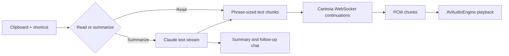

# AI Reader

**Copy text. Press a shortcut. Hear it as speech streams in.**

A native macOS menu-bar app that reads clipboard text aloud, summarizes it in a
chat window, and speaks summaries and follow-up answers while they are still
being generated.

Built by **Jackie Oliver** at Haptica, June 2026. I built the application,
provider integrations, streaming audio pipeline, playback controls, and macOS
packaging. Anthropic provides text generation; Cartesia provides speech synthesis.

**Stack:** Swift 6 · SwiftUI/AppKit · Swift concurrency · WebSockets/SSE · AVAudioEngine

## How it works



The app begins playback before the complete response exists. Text chunks share
one speech-generation context, and incoming raw PCM audio is scheduled directly
on the audio engine.

## Engineering decisions

| Problem | Implementation and rationale |
| --- | --- |
| Waiting for the whole summary makes speech feel slow. | Stream text into phrase-sized TTS continuations. Start preparing the speech connection while the text request is in flight, overlapping two sources of waiting. |
| Repeated shortcuts can start overlapping reads. | A single-flight coordinator coalesces requests: the latest request wins, and the previous pipeline gets a bounded teardown period before the next starts. |
| Cancelling a task alone does not guarantee that a socket receive stops. | Explicit provider cancellation, structured child tasks, and a cancellation watchdog bound teardown. A generation identifier routes audio to the correct request. |
| Warm connections reduce delay but can linger indefinitely. | Reuse the speech socket during active use and close it after a 120-second idle period. |
| Generation finishing is different from playback finishing. | Track scheduled audio buffers and their playback callbacks. Playback controls remain active while buffered audio is still audible. |
| Rebuilding or modifying an installed bundle can invalidate Accessibility grants. | Separate development/release app identities and apply build-time configuration before signing. Packaging checks cover identity, signatures, notarization, and checksums. |

The reasoning and before/after failure analysis are recorded in the
[streaming architecture review](docs/streaming-pipeline-architecture-review.md).
That document is a dated engineering record, including historical validation;
it is not a current benchmark report.

## Read the implementation

- [ReaderController](Sources/AIReaderApp/Services/ReaderController.swift): request coordination, preemption, text chunking, and UI state.
- [CartesiaSpeechService](Sources/AIReaderCore/Services/CartesiaSpeechService.swift): warm connections, continuations, context routing, and cancellation.
- [AudioPlaybackService](Sources/AIReaderApp/Services/AudioPlaybackService.swift): PCM buffering, playback completion, pause, seek, and replay.
- [AnthropicSummaryService](Sources/AIReaderCore/Services/AnthropicSummaryService.swift): streamed text and request cancellation.
- [Core tests](Tests/AIReaderCoreTests): provider request shapes, configuration, prompt/context handling, permissions, hotkeys, and app identity.

## Build and try

Requires macOS 14+, a Swift 6 toolchain, and your own provider keys for live
speech/summarization. Build and run tests without launching the app:

```sh
swift build
swift test
```

To launch the development app:

```sh
cp .env.example .env
./script/build_and_run.sh
```

The launch script installs `AI Reader Dev.app` in `/Applications`. Add provider
keys in the app; this development version stores them in the local `.env` file.
Grant Accessibility for the global shortcuts. Copy text, then press Control
twice to read it, or Control+Option to summarize and read it.

[Full shortcuts, configuration, and release procedures](docs/development.md).

## Development history

The original 13 development commits and four version tags are preserved here,
with shared-account author/committer metadata corrected to Jackie Oliver.
Commit identifiers changed during authorship correction and privacy filtering.
Development dates and code history are retained; debugging screenshots and local
Codex metadata were removed from every commit. Original AI co-author trailers remain.

Useful milestones:

- [Initial application](https://github.com/jackieoliver/ai-reader-native/commit/e2a3763).
- [Streaming lifecycle overhaul](https://github.com/jackieoliver/ai-reader-native/commit/229efdb): overlapping reads, stop behavior, connection lifetime, and playback state.
- [Build-time bundle configuration](https://github.com/jackieoliver/ai-reader-native/commit/13d3d65): configure the project path before signing.
- [Accessibility regression fix](https://github.com/jackieoliver/ai-reader-native/commit/b153e5f).
- [Checksum after stapling](https://github.com/jackieoliver/ai-reader-native/commit/c0c2f05): hash the final distributed artifact.

## Validation and limits

The app exposes timing reports for text generation, speech, and audio scheduling.
The 50 ms first-audio figure in the development notes is a design target, not a
measured end-to-end guarantee. Network and provider latency still apply.

During the October 6, 2026 documentation pass, `swift test` stopped at a
`PackageDescription` linker error in the installed command-line toolchain, before
app code or tests compiled. The current suite was not verified in that environment.
Live provider playback and signed-release installation were not rerun in that pass.

[Publication scope](PUBLICATION.md) documents the privacy boundary.
